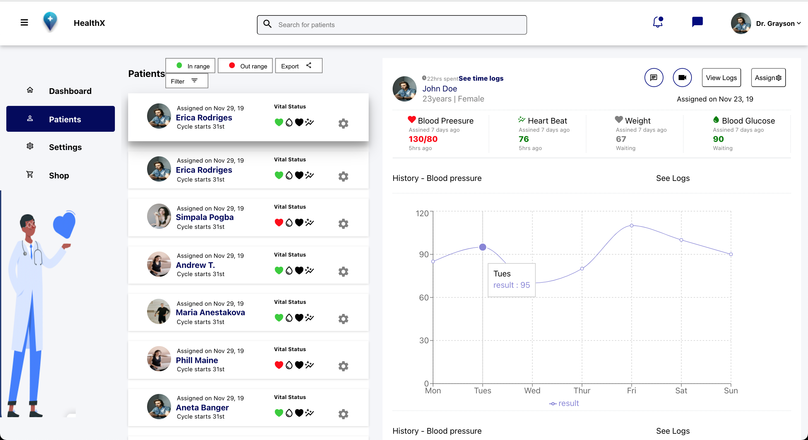

## Patient dashboard

This a UI of a dashboard displaying patients list and their information

## Live link
[Live link](https://dashboard-b9s0exaw3-phylischumba.vercel.app/patients)
## Built With

- React
- Styled components
- Recharts

## Getting Started

To get a local copy up and running follow these simple example steps.

### Prerequisites

- npm
- webpack

### Setup

- Clone the repository.
- Run `npm install` to install dependencies
- Run `http://localhost:3000/` from your browser

## 📝 License

This project is licensed under the MIT License.
